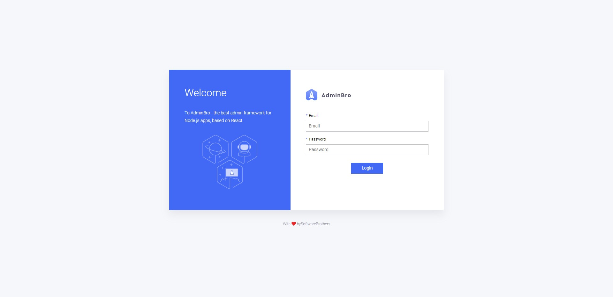

# Kutubee Assignment

## This guide will help you to run the assignment code

- You have to clone the repo
- get inside client directory
- use this command to install the backages `npm install`
- In case the above command not work you have to use the following command `npm install --force`
- You have to change `.env.example` to `.env`
- Run the following command to run the code `nodemon index`

## check the deployment

<https://kutubee-task-be.herokuapp.com/admin>

for sign in contact me for user and password

## LoginPage

### Landing page

### create new MemoryGame on backend

### create new QuizGame on backend

### Details and List

### filters on List View

### edit and delete on List View

